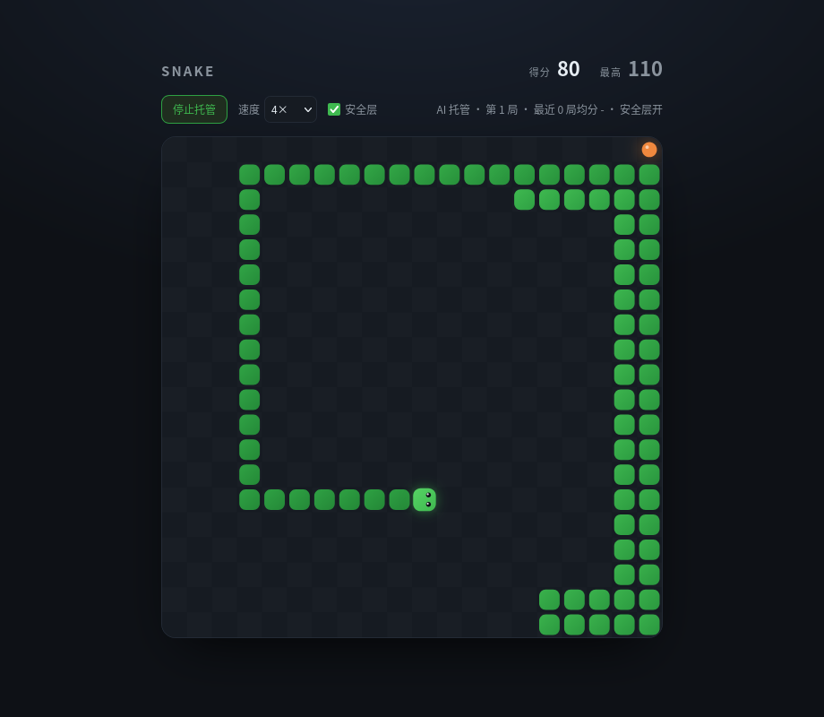

# Snake RL · 贪吃蛇强化学习 + 可验证安全层

20×20 贪吃蛇，从**手写可玩版本**一路做到：PPO 训练 → **可验证安全层**（逐位对拍的浏览器 JS ↔ Python 环境）→
**图论上界**（Hamilton 回路保证吃满）→ **GPU 常驻环境**（环境 4~12 倍加速）。

> 完整账本（结果表 / 文件地图 / 复现命令 / 下一步 / 9 个坑）见 **[STATE.md](STATE.md)**。



*单文件 HTML 里跑训练出来的策略：AI 托管 + 安全层开启（截图为 80 分中局，历史最高 110；安全层让同一条蛇从均分 66 抬到 104）。截图由 `game/js_shot_inject.js` 用无头 Firefox 生成。*

## 头号结果

| 路线 | 均分 | 每颗食物步数 | 吃满率（满分 397） |
|---|---:|---:|---:|
| **Hamilton 回路跟随**（图论，构造性保证不死） | **397** | 100.3 | **100%**（平均 39,802 步） |
| **PPO + 安全层**（训练时不用盾、推理时套盾） | **105.66** | **24.6** | 0%（长蛇阶段仍会自陷） |
| PPO 裸策略 | 62.47 | — | 0% |
| 手写启发式（BFS 追食物 + 尾巴安全检查） | 64~73 | — | 0% |
| 纯随机 | 0.04 | — | 0% |

**结论：吃满靠图论保证，效率靠学习。** RL 侧每颗食物的效率是图论的 **4 倍**，但它会走进"注定态"；
安全层能把它的自撞死亡从 51% 压到 4.7%，分数从 61.62 抬到 105.66（**零重训**）。

## 亮点

- **安全层是可验证的**：浏览器 JS 与 Python 环境逐位对拍 —— 170 维观测偏差 `0.000e+00`、
  贪心动作与安全判据 `393/393 = 100%` 一致、死亡次数与死因完全对齐。游戏内实测：套盾 66 → **104**。
- **GPU 常驻环境**：BFS 用位移+按位与在 GPU 上重写，与 numpy 版逐位一致（`test_torch_parity.py`）。
  环境吞吐 4~12 倍、端到端 **10~15k → 48~139k 步/秒**（一轮 30M 步实验从 ~35 分钟压到 ~5 分钟）。
- **验证优先的方法论**：每个"我证明/我优化好了"的结论都配一个能证伪它的测试
  （对抗测试 / 隔离测试 / 逐位对拍 / 随机策略压力测试）。今天靠这条习惯抓到 4 个真 bug，
  其中包括**作者自己提出的一个"可证明不死"不变量理论被压力测试在第 3378 步证伪**。

## 快速开始

```bash
# 环境（Python 3.11 + numpy + torch；GPU 需 CUDA 版 torch）
uv venv --python 3.11 && uv pip install numpy torch

# 规则对拍：向量化环境 vs 参考实现 vs torch 版
.venv/bin/python test_parity.py 5000
.venv/bin/python test_torch_parity.py 3000

# 图论上界：100% 吃满，平均 39,802 步
.venv/bin/python hamilton.py 64

# 训练（GPU）
.venv/bin/python train.py --device cuda --env-backend torch --grid 20 --n-envs 2048 \
  --rollout 128 --train-steps 30000000 --shaping 0.25 --out runs/demo

# 评估（无盾 / 旧盾 / 两级盾，同种子 200 局）
.venv/bin/python eval_any_ckpt.py runs/demo/ckpt.pt 200 20

# 导出策略并生成可直接双击打开的单文件游戏
.venv/bin/python export_policy.py runs/demo/ckpt.pt
.venv/bin/python build_game.py --out snake_ai.html
```

游戏：`snake_ai.html`（自包含单文件，双击即玩）。方向键/WASD 操控，空格暂停，R 重开；
右上角「AI 托管」让模型自己玩，可调 1×/4×/16× 速度，「安全层」开关即时对比有无护栏的表现。

## 目录

```
snake_env.py          numpy 向量化环境（规则/观测/奖励/安全盾）
snake_env_torch.py    GPU 常驻环境（与上一行逐位一致）
train.py              PPO 训练器（--env-backend torch 走 GPU）
hamilton.py           Hamilton 回路构造 + 跟随器（100% 吃满的证据）
baseline.py           启发式基线（BFS 追食物 + 尾巴安全检查）
export_policy.py      导出权重（base64 f32 + numpy 无损自检）
build_game.py         把权重内联进游戏模板，生成单文件 HTML
game/                 游戏模板 + 浏览器↔Python 逐位对拍链
check_mask.py         安全盾的对抗测试（拿可证明安全的动作去撞它）
check_cycle_shield.py 不变量压力测试（随机策略 + 每步校验）
test_*.py             对拍与隔离测试
eval_*.py             评估（多盾对照 / 吃满率 / 多 ckpt 同种子）
STATE.md              完整账本
```

## 诚实清单

1. **纯 RL 吃不满**：三种训练配置、最长 60M 步，吃满率均为 0%。
2. **"保证不死"的弧盾（`shield_mode="arc"`）只做成了安全半边**：不变量 1.28M 步零违反、3.84M 步零死亡，
   但它把 105 分的策略压到 5.7 分（可行集被压死）——缺的是经典 shortcut 算法的 reserved-cells 记账。
3. **A/B 的赢家会随时间翻转**：20M 步时 +4.64 分的奖励配置，训到 60M 步反而让裸策略从 62.47 掉到 27.71。
   A/B 结论只在相同训练预算内成立。

## 参考

- AlphaSnake (arXiv 2211.09622)：Snake 的最优策略被猜想为 NP-hard，Hamilton 回路保证必胜但很慢
- Ng et al. 1999：potential-based reward shaping（本项目所有塑形项都用这个形式，不改变最优策略）
- chynl/snake、kdavid001/snake-game：图搜索 vs 深度 RL 在贪吃蛇上的对比
